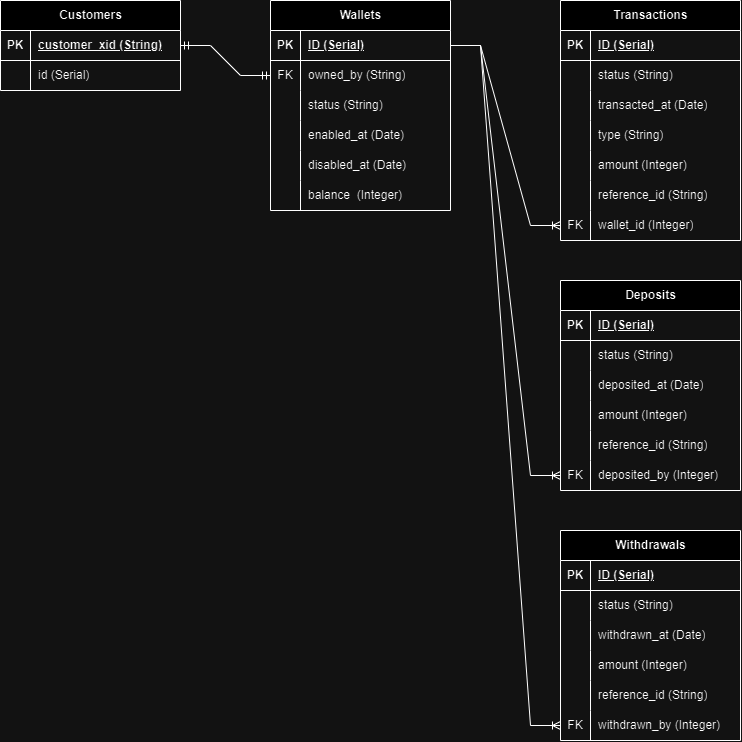

# Mini Wallet
mini_wallet practice for JULO backend developer.
The code is developed using node.js express

## Stack used
- Express
- Sequelize
- Postgres
- Jsonwebtoken

## ERD
The relationship for each of the table is shown below



## How to Use
### 1. Installation
- Install node and postgres in your pc/workstation
- For postgres, make sure you remember the username and password you used when setting up the database
- The common port for postgres is 5432
- The common username and password are postgres for both
### 2. Initial setup
- Clone the github repo to your desired folder location
- After cloning and opening the folder in VSCode run the command below
```
 npm install
```
- To make sure you get the sequelize-cli module, run this command
```
     npm i -d sequelize-cli
```
### 3. Setting up the database
- After installation, open the config folder and open the config.json
- On the development object, replace the username and password with the username and password you used for making postgres database
- If you wish to change the database name, replace value in database
-  Make sure the dialect is postgres
- Save the configuration
- Open your terminal and run these two commands to setup your database
```
    npx sequelize db:create
    npx sequelize db:migrate
```
### 4. Start the backend 
- If you wish to replace the port, go to app.js and replace the value in
```
    const port = 3000
```
- If you don't have nodemon installed, you can start the backend by running the command below in terminal. If it's running correctly you should see 'listening to {port_number}' on your terminal
```
    node app.js -w
```
- If you wish to use nodemon, install it first using the command below:
```
    npm i nodemon
```
- Then, start the backend  using the command below
```
    nodemon app.js
```

